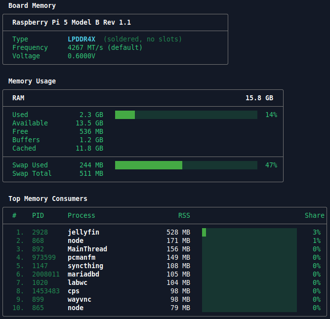

# raminfo


[Install](#install) · [Usage](#usage) · [Testing](#testing) · [Roadmap](#roadmap--todo) · [Contributing](CONTRIBUTING.md)

A minimal RAM inspection tool for Linux. Shows DIMM slot details (model, vendor, frequency), memory usage stats and top consumers — in a clean, `btop`-style TUI.
Raspberry Pi supported. 
> **Linux only.** Requires `/proc`, `/sys/class/hwmon`, and `dmidecode`.

```
  DIMM Slots
╭──────────┬────────────────────────┬────────────────┬─────────┬──────┬───────────┬───────────┬─────────╮
│ Slot     │ Part Number            │ Vendor         │    Size │ Type │  Max MT/s │  Cfg MT/s │ Voltage │
├──────────┼────────────────────────┼────────────────┼─────────┼──────┼───────────┼───────────┼─────────┤
│ ChannelA │ M471A2G43CB2-CWE       │ Samsung        │   16 GB │ DDR4 │      3200 │      3200 │  1.2 V  │
│ ChannelB │ M471A2G43CB2-CWE       │ Samsung        │   16 GB │ DDR4 │      3200 │      3200 │  1.2 V  │
╰──────────┴────────────────────────┴────────────────┴─────────┴──────┴───────────┴───────────┴─────────╯

  Memory Usage
╭──────────────────────────────────────────────────────────────────────╮
│  RAM  32 GB installed across 2 DIMM slots                   31.3 GB  │
├──────────────────────────────────────────────────────────────────────┤
│  Used            18.0 GB   █████████████████████░░░░░░░░░░░░░░░  57% │
│  Available       13.3 GB                                             │
│  Free             1.4 GB                                             │
│  Buffers          1.5 GB                                             │
│  Cached           8.5 GB                                             │
├──────────────────────────────────────────────────────────────────────┤
│  Swap Used        555 MB   █░░░░░░░░░░░░░░░░░░░░░░░░░░░░░░░░░░░   3% │
│  Swap Total      16.0 GB                                             │
╰──────────────────────────────────────────────────────────────────────╯

  Top Memory Consumers
╭────────────────────────────────────────────────────────────────────────────────╮
│  #    PID      Process                     RSS                           Share │
├────────────────────────────────────────────────────────────────────────────────┤
│   1.  9703     phpstorm                 5.7 GB   ████░░░░░░░░░░░░░░░░░░░░  18% │
│   2.  9907     copilot-languag          883 MB   █░░░░░░░░░░░░░░░░░░░░░░░   2% │
│   3.  10702    chrome                   821 MB   █░░░░░░░░░░░░░░░░░░░░░░░   2% │
╰────────────────────────────────────────────────────────────────────────────────╯

 Upgrade Potential
╭────────────────────────────────────────────────────────╮
│  Slots           2 used / 4 total  ●●○○                │
│  Installed       32 GB                                 │
│  Maximum         64 GB                                 │
│  Headroom        32 GB available                       │
│  Max Freq        3200 MT/s                             │
╰────────────────────────────────────────────────────────╯

  Motherboard
╭──────────────────────────────────────────────────────────────────────╮
│  Manufacturer        Gigabyte Technology Co., Ltd.                   │
│  Product             Z390 GAMING SLI-CF                              │
╰──────────────────────────────────────────────────────────────────────╯
```

Or in RaspberryPi

```
  Board Memory
╭────────────────────────────────────────────────────────╮
│  Raspberry Pi 5 Model B Rev 1.1                        │
├────────────────────────────────────────────────────────┤
│  Type          LPDDR4X  (soldered, no slots)           │
│  Frequency     4267 MT/s (default)                     │
│  Voltage       0.6000V                                 │
╰────────────────────────────────────────────────────────╯

  Memory Usage
╭──────────────────────────────────────────────────────────────────────╮
│  RAM                                                        15.8 GB  │
├──────────────────────────────────────────────────────────────────────┤
│  Used             2.3 GB   █████░░░░░░░░░░░░░░░░░░░░░░░░░░░░░░░  14% │
│  Available       13.5 GB                                             │
│  Free             536 MB                                             │
│  Buffers          1.2 GB                                             │
│  Cached          11.8 GB                                             │
├──────────────────────────────────────────────────────────────────────┤
│  Swap Used        244 MB   █████████████████░░░░░░░░░░░░░░░░░░░  47% │
│  Swap Total       511 MB                                             │
╰──────────────────────────────────────────────────────────────────────╯

  Top Memory Consumers
╭─────────────────────────────────────────────────────────────────────────────────╮
│  #    PID      Process                     RSS                             Share│
├─────────────────────────────────────────────────────────────────────────────────┤
│   1.  2928     jellyfin                 528 MB   █░░░░░░░░░░░░░░░░░░░░░░░    3% │
│   2.  868      node                     171 MB   ░░░░░░░░░░░░░░░░░░░░░░░░    1% │
│   3.  892      MainThread               156 MB   ░░░░░░░░░░░░░░░░░░░░░░░░    0% │
│   4.  973599   pcmanfm                  149 MB   ░░░░░░░░░░░░░░░░░░░░░░░░    0% │
│   5.  1147     syncthing                108 MB   ░░░░░░░░░░░░░░░░░░░░░░░░    0% │
│   6.  2008011  mariadbd                 105 MB   ░░░░░░░░░░░░░░░░░░░░░░░░    0% │
│   7.  1020     labwc                    104 MB   ░░░░░░░░░░░░░░░░░░░░░░░░    0% │
│   8.  1453483  cps                       98 MB   ░░░░░░░░░░░░░░░░░░░░░░░░    0% │
│   9.  899      wayvnc                    98 MB   ░░░░░░░░░░░░░░░░░░░░░░░░    0% │
│  10.  865      node                      79 MB   ░░░░░░░░░░░░░░░░░░░░░░░░    0% │
╰─────────────────────────────────────────────────────────────────────────────────╯
```

## Screenshot





## RAM Temperatures

Temperature support depends on hardware. The `RAM Temperatures` section is shown automatically when sensors are available and silently skipped when they are not.

| Hardware | Support |
|---|---|
| DDR5 | ✅ via `spd5118` kernel driver |
| DDR4 | ❌ no sensor chip on the DIMM itself |

On DDR4 systems the section will never appear — this is expected, not a bug.


# Install

## 1. Cargo (if you have Rust)

```bash
cargo install raminfo
```

That's it. The binary lands in `~/.cargo/bin/` which is already in your `$PATH` if Rust is set up normally.

---

## 2. Pre-compiled binaries

Download the binary for your architecture from the [Releases](https://github.com/swayoleg/raminfo/releases) page.

| File | Target |
|---|---|
| `raminfo-x86_64-linux` | 64-bit Linux (most desktops / servers) |
| `raminfo-aarch64-linux` | 64-bit ARM — modern distros (Raspberry Pi 4/5 on Ubuntu 22.04+, AWS Graviton) |
| `raminfo-aarch64-linux-static` | 64-bit ARM — older distros (Raspberry Pi 4/5 on Raspberry Pi OS Bullseye/Bookworm) |
| `raminfo-armv7-linux` | 32-bit ARM — modern distros (Raspberry Pi 2/3 on Ubuntu 22.04+) |
| `raminfo-armv7-linux-static` | 32-bit ARM — older distros (Raspberry Pi 2/3 on Raspberry Pi OS Bullseye/Bookworm) |


```bash
# example for x86_64
curl -L https://github.com/swayoleg/raminfo/releases/latest/download/raminfo-x86_64-linux \
  -o raminfo
chmod +x raminfo
sudo mv raminfo /usr/local/bin/
```

---

## 3. Compile from source
```bash
git clone https://github.com/swayoleg/raminfo
cd raminfo
cargo build --release
sudo cp target/release/raminfo /usr/local/bin/
```

**Cross-compiling for ARM** (from an x86 machine):
```bash
# install targets
rustup target add aarch64-unknown-linux-gnu
rustup target add aarch64-unknown-linux-musl
rustup target add armv7-unknown-linux-gnueabihf
rustup target add armv7-unknown-linux-musleabihf

# install cross-linkers (Ubuntu/Debian)
sudo apt install musl-tools gcc-aarch64-linux-gnu gcc-arm-linux-gnueabihf

# build gnu (modern distros)
cargo build --release --target aarch64-unknown-linux-gnu
cargo build --release --target armv7-unknown-linux-gnueabihf

# build musl/static (older distros, Raspberry Pi OS)
cargo build --release --target aarch64-unknown-linux-musl
cargo build --release --target armv7-unknown-linux-musleabihf
```

Also add to `.cargo/config.toml`:
```toml
[target.aarch64-unknown-linux-gnu]
linker = "aarch64-linux-gnu-gcc"

[target.armv7-unknown-linux-gnueabihf]
linker = "arm-linux-gnueabihf-gcc"

[target.aarch64-unknown-linux-musl]
linker = "aarch64-linux-gnu-gcc"
rustflags = ["-C", "target-feature=+crt-static"]

[target.armv7-unknown-linux-musleabihf]
linker = "arm-linux-gnueabihf-gcc"
rustflags = ["-C", "target-feature=+crt-static"]
```

Binaries will be in `target/<target-triple>/release/raminfo`.

---

## Post-install: dmidecode

DIMM slot details require `dmidecode`:

```bash
# Debian / Ubuntu
sudo apt install dmidecode

# Arch
sudo pacman -S dmidecode

# Fedora
sudo dnf install dmidecode
```

For passwordless sudo, add to `/etc/sudoers`:
```
your_user ALL=(ALL) NOPASSWD: /usr/sbin/dmidecode
```

# Usage

```bash
sudo raminfo        # full output including DIMM hardware details
raminfo             # memory stats and top consumers (no sudo needed)
```

DIMM slot info requires `sudo` to call `dmidecode`. For passwordless use, add to `/etc/sudoers`:
```
your_user ALL=(ALL) NOPASSWD: /usr/sbin/dmidecode
```

## Options

| Flag | Description |
|---|---|
| `--json` | Print a single JSON snapshot instead of the TUI (for scripting / `jq`) |
| `--monitor` | Continuously refresh the dynamic sections (memory usage, temps, top consumers) — redraws the TUI in place each cycle (uses the alternate screen buffer like `htop`/`btop`; restores your terminal on Ctrl+C) |
| `--interval <seconds>` | Refresh rate for `--monitor` mode (default: `2`, minimum `1`). Also accepts `--interval=<seconds>` |
| `-h`, `--help` | Print usage and exit |

```bash
raminfo --json | jq                       # single JSON object (full snapshot)
raminfo --json | jq '.mem.total_kb'       # pick out one field
raminfo --monitor                         # live-refreshing TUI
raminfo --monitor --interval 5            # refresh every 5 seconds
raminfo --monitor --json | jq -c .        # ndjson stream, one object per refresh

# follow a single field live (jq --unbuffered so it prints each line as it arrives)
raminfo --monitor --json --interval 2 | jq --unbuffered '.mem.available_kb'

# log samples to a file for later analysis
raminfo --monitor --json >> ram-log.ndjson
```

`--json` (single-shot) prints one compact object with the **full** snapshot
(DIMM slots, motherboard, memory array, usage, consumers).

**Monitor mode only refreshes what changes** — memory usage, temperatures, and
top consumers. Static hardware details (DIMM slots, motherboard, max capacity)
are shown once by the single-shot commands and omitted from monitor output, so
`--monitor` stays focused and doesn't re-run `dmidecode` every cycle. Under
`--monitor --json` each ndjson line therefore contains just `mem`, `temps`, and
`top_consumers` — ideal for logging or streaming into tools that read a line at
a time.

# Library

The core parsing lives in a reusable `raminfo` library crate. Add it to your project:

```bash
cargo add raminfo
```

or in `Cargo.toml`:

```toml
[dependencies]
raminfo = "0.1"
```

The crate exposes two tiers of functions, depending on whether you want it to
read the system for you or just parse text you already have.

### 1. Read the system for you

The simplest entry point is `collect_snapshot`, which gathers every data source
into one serializable [`Snapshot`]:

```rust
fn main() {
    let snap = raminfo::parsers::collect_snapshot();

    println!("Total RAM: {} kB", snap.mem.total_kb);
    for dimm in &snap.dimms {
        println!("{}: {} MB {}", dimm.locator, dimm.size_mb, dimm.mem_type);
    }

    // Or serialize the whole snapshot to JSON:
    println!("{}", raminfo::json::to_json(&snap));
}
```

Prefer one source? Call a single collector — each reads its source directly:

```rust
let mem   = raminfo::parsers::parse_proc_meminfo();   // /proc/meminfo
let dimms = raminfo::parsers::parse_dmidecode();      // dmidecode -t 17 (needs sudo)
let temps = raminfo::parsers::read_ram_temps();       // /sys/class/hwmon
let top   = raminfo::parsers::top_mem_consumers(5);   // /proc/*/status
```

All of these degrade gracefully (returning empty/default data) when a source is
unavailable — they never panic. DIMM and motherboard details require `dmidecode`
(typically via sudo).

### 2. Use it as a pure parser (bring your own text)

If you already have the raw text — read from a file, captured on another machine,
or produced by your own privileged call — the `*_content` / `*_output` functions
parse a `&str` into the same structs and touch nothing on your system:

```rust
use raminfo::parsers::{parse_meminfo_content, parse_dmidecode_output};

// e.g. text you collected over SSH from a remote host
let meminfo = std::fs::read_to_string("captured/meminfo.txt").unwrap();
let stats   = parse_meminfo_content(&meminfo);
println!("remote total: {} kB", stats.total_kb);

let dmi   = std::fs::read_to_string("captured/dmidecode-17.txt").unwrap();
let dimms = parse_dmidecode_output(&dmi);
println!("remote DIMMs: {}", dimms.len());
```

Pure parsers available: `parse_meminfo_content`, `parse_dmidecode_output`,
`parse_dmidecode_array_output`, `parse_mobo_output`, and `parse_cpuinfo_for_pi`.
These are deterministic and side-effect-free, which is exactly what the test
suite exercises with mock data.

### API docs

Every public item is documented, and the crate's own doc examples are compiled
and run as doctests (`cargo test`), so the documented API stays correct. Browse
the full API locally with:

```bash
cargo doc --open --no-deps
```

# Testing

```bash
cargo test                        # run all tests
cargo test --test format_tests    # formatting helpers only
cargo test --test parsing_tests   # parser logic only
```

Tests live in the `tests/` directory and cover formatting utilities (`format.rs`), all parsing logic (`parsers.rs`), and JSON output (`json.rs`) using mock system data. Argument parsing is unit-tested inline in `main.rs`. The `src/lib.rs` file also exposes the crate as a reusable [library](#library).

# Roadmap / TODO

- [x] Cover with tests
- [x] `--monitor` — live refresh mode
- [x] `--interval <seconds>` — refresh rate for monitor mode (default: 2s)
- [x] `--monitor --json` — newline-delimited JSON stream (ndjson)
- [x] `--json` — single-shot JSON output for scripting and piping to `jq`
- [ ] Windows support via WMI (`Win32_PhysicalMemory`, `Win32_OperatingSystem`)
- [x] Refactor into lib + binary — expose core parsing as a reusable library crate

# Dependencies

- [`colored`](https://crates.io/crates/colored) — terminal colors
- [`serde`](https://crates.io/crates/serde) / [`serde_json`](https://crates.io/crates/serde_json) — JSON output (`--json`) and serializable data structures
- [`ctrlc`](https://crates.io/crates/ctrlc) — restore the terminal on Ctrl+C in `--monitor` mode
- `dmidecode` — system package, required for DIMM slot details, will ignore dim slots if not installed
