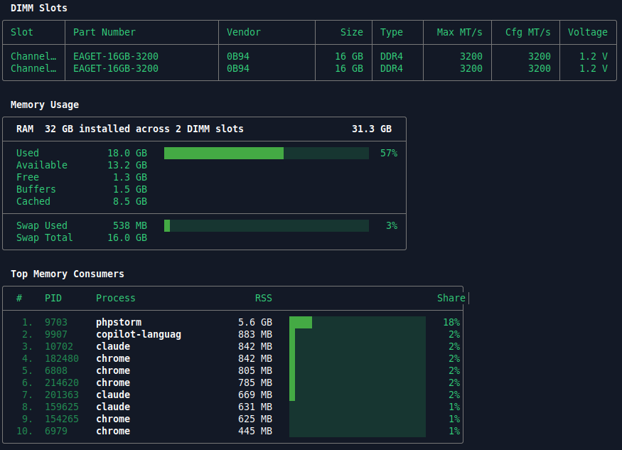

# raminfo


[Install](#install) · [Usage](#usage) · [Roadmap](#roadmap--todo) · [Contributing](CONTRIBUTING.md)

A minimal RAM inspection tool for Linux. Shows DIMM slot details (model, vendor, frequency), memory usage stats and top consumers — in a clean, `btop`-style TUI.

> **Linux only.** Requires `/proc`, `/sys/class/hwmon`, and `dmidecode`.

```
  DIMM Slots
╭──────────┬────────────────────────┬────────────────┬─────────┬──────┬───────────┬───────────┬─────────╮
│ Slot     │ Part Number            │ Vendor         │    Size │ Type │  Max MT/s │  Cfg MT/s │ Voltage │
├──────────┼────────────────────────┼────────────────┼─────────┼──────┼───────────┼───────────┼─────────┤
│ ChannelA │ M471A2G43CB2-CWE       │ Samsung        │   16 GB │ DDR4 │      3200 │      3200 │  1.2 V  │
│ ChannelB │ M471A2G43CB2-CWE       │ Samsung        │   16 GB │ DDR4 │      3200 │      3200 │  1.2 V  │
╰──────────┴────────────────────────┴────────────────┴─────────┴──────┴───────────┴───────────┴─────────╯

  Memory Usage
╭──────────────────────────────────────────────────────────────────────╮
│  RAM  32 GB installed across 2 DIMM slots                   31.3 GB  │
├──────────────────────────────────────────────────────────────────────┤
│  Used            18.0 GB   █████████████████████░░░░░░░░░░░░░░░  57% │
│  Available       13.3 GB                                             │
│  Free             1.4 GB                                             │
│  Buffers          1.5 GB                                             │
│  Cached           8.5 GB                                             │
├──────────────────────────────────────────────────────────────────────┤
│  Swap Used        555 MB   █░░░░░░░░░░░░░░░░░░░░░░░░░░░░░░░░░░░   3% │
│  Swap Total      16.0 GB                                             │
╰──────────────────────────────────────────────────────────────────────╯

  Top Memory Consumers
╭────────────────────────────────────────────────────────────────────────────────╮
│  #    PID      Process                     RSS                           Share  │
├────────────────────────────────────────────────────────────────────────────────┤
│   1.  9703     phpstorm                 5.7 GB   ████░░░░░░░░░░░░░░░░░░░░  18% │
│   2.  9907     copilot-languag          883 MB   █░░░░░░░░░░░░░░░░░░░░░░░   2% │
│   3.  10702    chrome                   821 MB   █░░░░░░░░░░░░░░░░░░░░░░░   2% │
╰────────────────────────────────────────────────────────────────────────────────╯
```

## Screenshot




## RAM Temperatures

Temperature support depends on hardware. The `RAM Temperatures` section is shown automatically when sensors are available and silently skipped when they are not.

| Hardware | Support |
|---|---|
| DDR5 | ✅ via `spd5118` kernel driver |
| DDR4 | ❌ no sensor chip on the DIMM itself |

On DDR4 systems the section will never appear — this is expected, not a bug.


# Install

## 1. Cargo (if you have Rust)

```bash
cargo install raminfo
```

That's it. The binary lands in `~/.cargo/bin/` which is already in your `$PATH` if Rust is set up normally.

---

## 2. Pre-compiled binaries

Download the binary for your architecture from the [Releases](https://github.com/swayoleg/raminfo/releases) page.

| File | Target |
|---|---|
| `raminfo-x86_64-linux` | 64-bit Linux (most desktops / servers) |
| `raminfo-aarch64-linux` | 64-bit ARM — modern distros (Raspberry Pi 4/5 on Ubuntu 22.04+, AWS Graviton) |
| `raminfo-aarch64-linux-static` | 64-bit ARM — older distros (Raspberry Pi 4/5 on Raspberry Pi OS Bullseye/Bookworm) |
| `raminfo-armv7-linux` | 32-bit ARM — modern distros (Raspberry Pi 2/3 on Ubuntu 22.04+) |
| `raminfo-armv7-linux-static` | 32-bit ARM — older distros (Raspberry Pi 2/3 on Raspberry Pi OS Bullseye/Bookworm) |


```bash
# example for x86_64
curl -L https://github.com/swayoleg/raminfo/releases/latest/download/raminfo-x86_64-linux \
  -o raminfo
chmod +x raminfo
sudo mv raminfo /usr/local/bin/
```

---

## 3. Compile from source

```bash
git clone https://github.com/swayoleg/raminfo
cd raminfo
cargo build --release
sudo cp target/release/raminfo /usr/local/bin/
```


## 3. Compile from source
```bash
git clone https://github.com/swayoleg/raminfo
cd raminfo
cargo build --release
sudo cp target/release/raminfo /usr/local/bin/
```

**Cross-compiling for ARM** (from an x86 machine):
```bash
# install targets
rustup target add aarch64-unknown-linux-gnu
rustup target add aarch64-unknown-linux-musl
rustup target add armv7-unknown-linux-gnueabihf
rustup target add armv7-unknown-linux-musleabihf

# install cross-linkers (Ubuntu/Debian)
sudo apt install musl-tools gcc-aarch64-linux-gnu gcc-arm-linux-gnueabihf

# build gnu (modern distros)
cargo build --release --target aarch64-unknown-linux-gnu
cargo build --release --target armv7-unknown-linux-gnueabihf

# build musl/static (older distros, Raspberry Pi OS)
cargo build --release --target aarch64-unknown-linux-musl
cargo build --release --target armv7-unknown-linux-musleabihf
```

Also add to `.cargo/config.toml`:
```toml
[target.aarch64-unknown-linux-gnu]
linker = "aarch64-linux-gnu-gcc"

[target.armv7-unknown-linux-gnueabihf]
linker = "arm-linux-gnueabihf-gcc"

[target.aarch64-unknown-linux-musl]
linker = "aarch64-linux-gnu-gcc"
rustflags = ["-C", "target-feature=+crt-static"]

[target.armv7-unknown-linux-musleabihf]
linker = "arm-linux-gnueabihf-gcc"
rustflags = ["-C", "target-feature=+crt-static"]
```

Binaries will be in `target/<target-triple>/release/raminfo`.


**Cross-compiling for ARM** (from an x86 machine):

```bash
# install targets
rustup target add aarch64-unknown-linux-gnu
rustup target add armv7-unknown-linux-gnueabihf

# install cross-linkers (Ubuntu/Debian)
sudo apt install gcc-aarch64-linux-gnu gcc-arm-linux-gnueabihf

# build
cargo build --release --target aarch64-unknown-linux-gnu
cargo build --release --target armv7-unknown-linux-gnueabihf
```

Binaries will be in `target/<target-triple>/release/raminfo`.

---

## Post-install: dmidecode

DIMM slot details require `dmidecode`:

```bash
# Debian / Ubuntu
sudo apt install dmidecode

# Arch
sudo pacman -S dmidecode

# Fedora
sudo dnf install dmidecode
```

For passwordless sudo, add to `/etc/sudoers`:
```
your_user ALL=(ALL) NOPASSWD: /usr/sbin/dmidecode
```

# Usage

```bash
sudo raminfo        # full output including DIMM hardware details
raminfo             # memory stats and top consumers (no sudo needed)
```

DIMM slot info requires `sudo` to call `dmidecode`. For passwordless use, add to `/etc/sudoers`:
```
your_user ALL=(ALL) NOPASSWD: /usr/sbin/dmidecode
```

# Roadmap / TODO

- [ ] Cover with tests
- [ ] `--monitor` — live refresh mode
- [ ] `--interval <seconds>` — refresh rate for monitor mode (default: 2s)
- [ ] `--monitor --json` — newline-delimited JSON stream (ndjson)
- [ ] `--json` — single-shot JSON output for scripting and piping to `jq`
- [ ] Windows support via WMI (`Win32_PhysicalMemory`, `Win32_OperatingSystem`)
- [ ] Refactor into lib + binary — expose core parsing as a reusable library crate

# Dependencies

- [`colored`](https://crates.io/crates/colored) — terminal colors
- `dmidecode` — system package, required for DIMM slot details, will ignore dim slots if not installed
